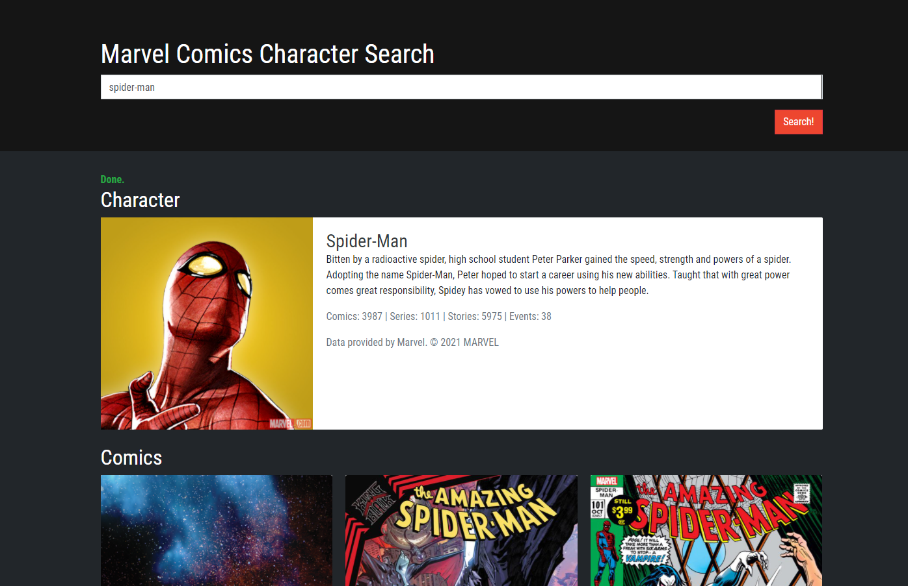

# API marvel
Mecanismo de pesquisa da Marvel usando a API da Marvel. 
<strong>API: </strong>https://developer.marvel.com

## Como executar
1- Baixar e instalar o XAMPP 
2- Mover o projeto para "C:\xampp\htdocs" 
3- Startar o apache no painel de controle do XAMPP 
3- No URL do navegador colocar "http://localhost:PORTA/" 

## screenshot

